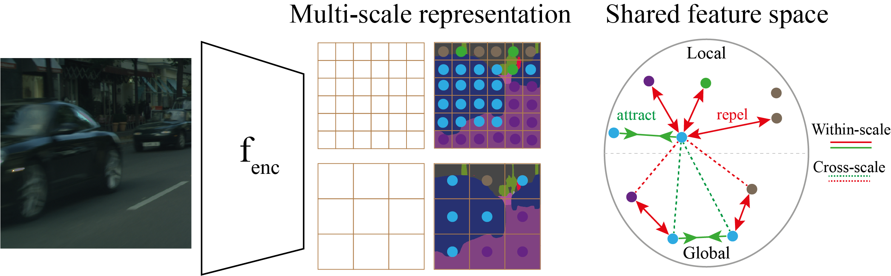

# MS_CS_ContrSeg
Implementation of "Multi-scale and Cross-scale Contrastive Learning for Semantic Segmentation", to appear at ECCV 2022

arxiv link : https://arxiv.org/abs/2203.13409
<!--  -->



> [**Multi-scale and Cross-scale Contrastive Learning for Semantic Segmentation**](https://arxiv.org/abs/2203.13409),            
> [Theodoros Pissas](https://rvim.online/author/theodoros-pissas/), [Claudio S. Ravasio](https://rvim.online/author/claudio-ravasio/), [Lyndon Da Cruz](), [Christos Bergeles](https://rvim.online/author/christos-bergeles/)  <br>
>
> *arXiv technical report ([arXiv 2203.13409](https://arxiv.org/abs/2203.13409))*
>
> *ECCV 2022 ([proceedings]())*

## Log
- 20/07 loss code public
- Coming soon: pretrained checkpoints and more configs for more models 


## Data and requirements
1) Download  datasets 
2) Modify paths as per your setup in configs/paths_info.json to add path to a folder and a log_path and a data_path (see example in paths_info.json)
  <br> a) data_path should be the root directory of the datasets
  <br> b) log_path is where you want each run to generate a directory containing logs/checkpoints to be stored 
3) Create conda environment with pytorch 1.7 and CUDA 10.0
    ```bash
    conda env create -f env_dgx.yml 
    conda activate semseg
    ```

## Train
To train a model we specify most settings using json configuration files, found in ```configs```.
For each model on each dataset uses its own config. We also specify a few settings from commandline (see main.py) 
and also can override config settings from the commandline (see main.py)
Here we show commands to start training on 4 GPUs and with the settings used in the paper. 

Training with ResNet or HRNet backbones requires imagenet initialization which is handled by torchvision or downloaded from a url respectively.
To train with Swin backbones we use the provided imagenet checkpoints from their official implementation https://github.com/microsoft/Swin-Transformer/.
These must be downloaded in a directory called pytorch_checkpoints structured as follows:
   
    ```
    pytorch_checkpoints/swin_imagenet/swin_tiny_patch4_window7_224.pth
                                     /swin_small_patch4_window7_224.pth
                                     /swin_base_patch4_window7_224.pth
                                     /swin_large_patch4_window7_224_22k.pth
    ```
Example commands to start training (d = cuda device ids, p = multigpu training bs = batch size, w = workers per gpu ): 
- For HRNet on Cityscapes:
    ```bash
    python main.py -d 0,1,2,3 -p -u theo -c configs/CITYSCAPES/hrnet_contrastive_CTS.json -bs 12 -w 3
    ```
- For UPerNet SwinT on ADE20K:
    ```bash
    python main.py -d 0,1,2,3 -p -u theo -c configs/upnswin_contrastive_ADE20K.json  -bs 16 -w 4
    ```

[//]: # (## Run a pretrained model)

[//]: # (- Example of how to run inference with pretrained model:)

[//]: # (    ```bash)

[//]: # (    python main.py -d 0 -u theo -c configs/ADE20K/upnswin_contrastive_ADE20K.json -bs 1 -w 4 -m inference -cpt 20220303_230257_e1__upn_alignFalse_projFpn_swinT_sbn_DCms_cs_epochs127_bs16 -so)

[//]: # (    ```)

## Licensing and copyright 

Please see the LICENSE file for details.

## Acknowledgements

This project utilizes [timm] and the official implementation of [swin] Transformer. 
We thank the authors of those projects for open-sourcing their code and model weights.

[timm]: https://github.com/rwightman/pytorch-image-models

[swin]: https://github.com/microsoft/Swin-Transformer/

## Citation
If you found the paper or code useful please cite the following:

```
@misc{https://doi.org/10.48550/arxiv.2203.13409,
  doi = {10.48550/ARXIV.2203.13409},
  url = {https://arxiv.org/abs/2203.13409},
  author = {Pissas, Theodoros and Ravasio, Claudio S. and Da Cruz, Lyndon and Bergeles, Christos},
  keywords = {Computer Vision and Pattern Recognition (cs.CV), FOS: Computer and information sciences, FOS: Computer and information sciences},
  title = {Multi-scale and Cross-scale Contrastive Learning for Semantic Segmentation},
  publisher = {arXiv},
  year = {2022},
  copyright = {Creative Commons Attribution Non Commercial Share Alike 4.0 International}
}
```
